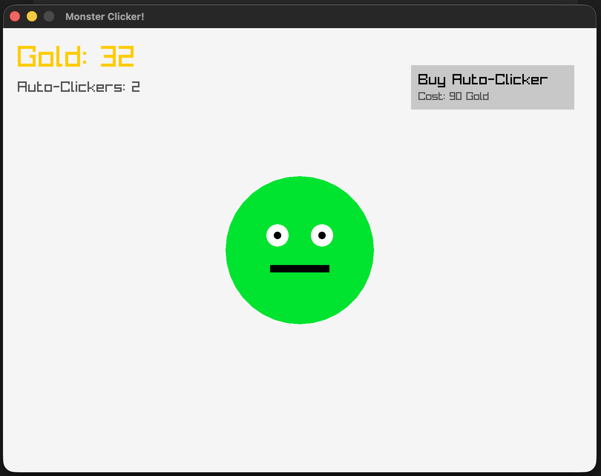
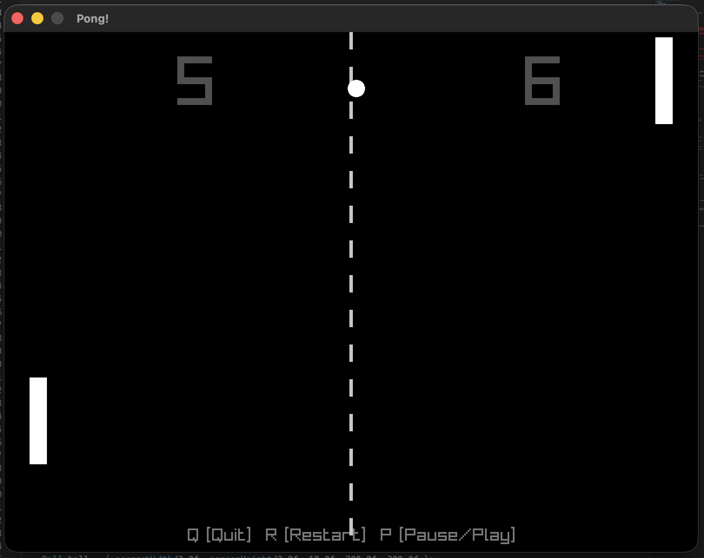
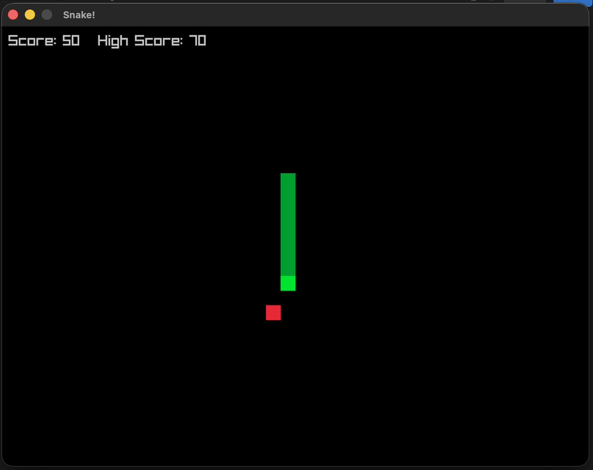
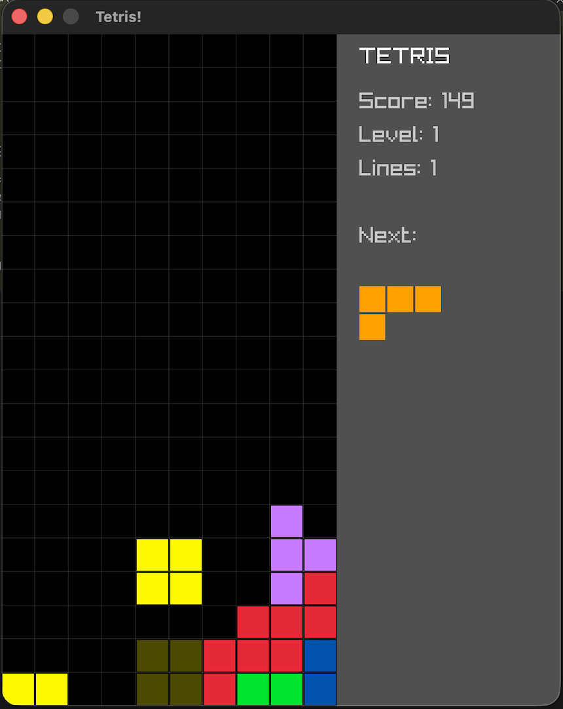
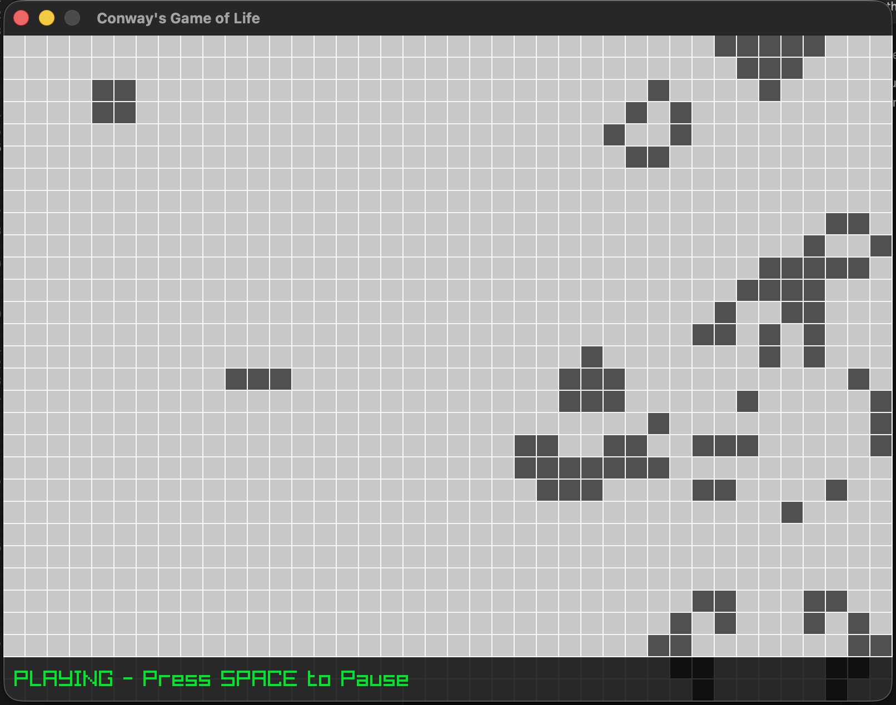
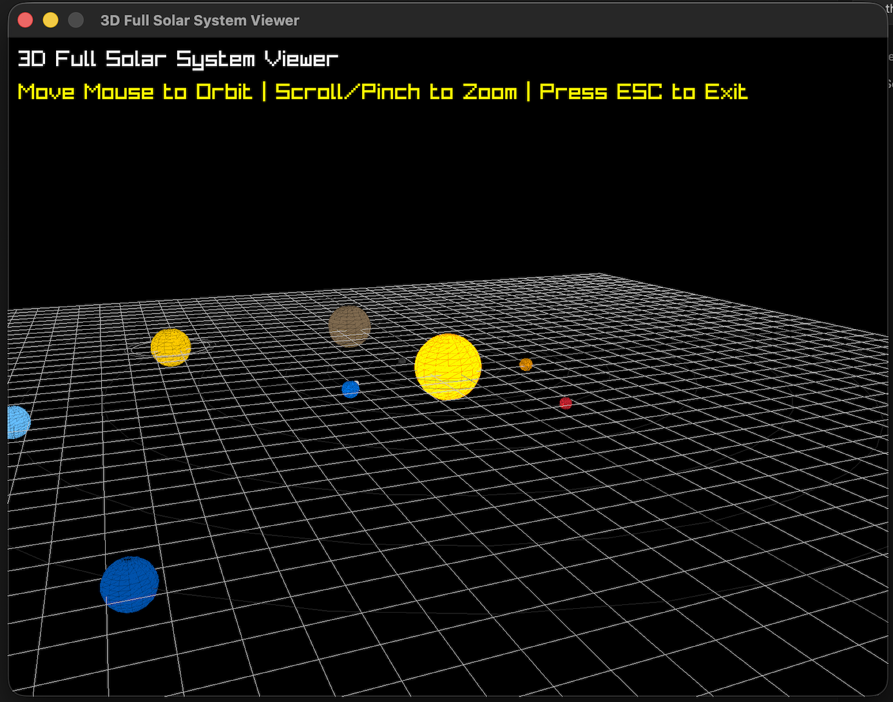

# C++ Educational Sandbox

Welcome to the C++ Educational Sandbox! This repository is a progression-based curriculum designed to teach core Computer Science concepts and modern C++ by building fully interactive graphical applications and games from scratch. 

We bypass dry console tutorials and dive straight into visual, real-time programming using the **Raylib** graphics library.

## Curriculum Map

The curriculum is split into two main sections: **Games** (the core progression) and **Advanced** (deep dives into specific algorithms or 3D concepts).

### Core Progression (Games)

Each game in this sequence builds upon the knowledge of the previous one, slowly introducing more complex architectures and data structures.

1. **[Monster Clicker](games/clicker/readme.md)**<br>
   <br>
   - **Concepts:** The Game Loop, Cartesian Coordinate Systems (X,Y), Basic Input, and AABB UI Collision.
   - **Goal:** Get a window on the screen and interact with it.

2. **[Pong](games/pong/readme.md)**<br>
   <br>
   - **Concepts:** State Machines (`enums`), Delta Time, Dynamic Physics, and Audio Playback.
   - **Goal:** Build a complete game cycle (Menu -> Play -> Game Over) with continuous movement.

3. **[Snake](games/snake/readme.md)**<br>
   <br>
   - **Concepts:** Dynamic Arrays (`std::vector`), Grid-Based Math, and Memory Shifting.
   - **Goal:** Manage an entity that continuously grows in size over time.

4. **[Tetris](games/tetris/readme.md)**<br>
   <br>
   - **Concepts:** 2D Arrays (`int[][]`), Matrix Transformation (Rotation), and Line-Clearing Algorithms.
   - **Goal:** Use multi-dimensional arrays as the primary state engine for a visual board.

5. **[Super C++ Platformer](games/platformer/readme.md)**<br>
   <br>
   - **Concepts:** Continuous Physics (Gravity/Velocity), 2D Cameras, Pixel Art Animation, and AI Patrolling.
   - **Goal:** Break free from grids and build a scrolling world with robust AABB collision detection.

### Advanced Modules

These modules stand alone and tackle specific, higher-level mathematical or algorithmic challenges.

- **[Game of Life](advanced/game_of_life/readme.md)**<br>
   <br>
   - **Concepts:** Cellular Automata, Nested Loops, and Discrete Logic Processing.
   - **Goal:** Visualize complex mathematical rules operating on a massive scale.

- **[Solar System Viewer](advanced/solar_system/readme.md)**<br>
   <br>
   - **Concepts:** 3D Coordinate Spaces (X,Y,Z), Spatial Vectors, and Trigonometry over Time (`sin`/`cos`).
   - **Goal:** Shatter the illusion that 3D programming is impossible for beginners.

## Setup & Prerequisites

This sandbox uses **CMake** to automatically fetch dependencies (like Raylib) and compile the code. You do not need to install Raylib manually.

1. Install CMake on your system.
2. Navigate into any of the project directories (e.g., `cd games/pong`).
3. Run the standard CMake build commands:
   ```bash
   mkdir build && cd build
   cmake ..
   make
   ./[ExecutableName]
   ```

*Happy coding!*
