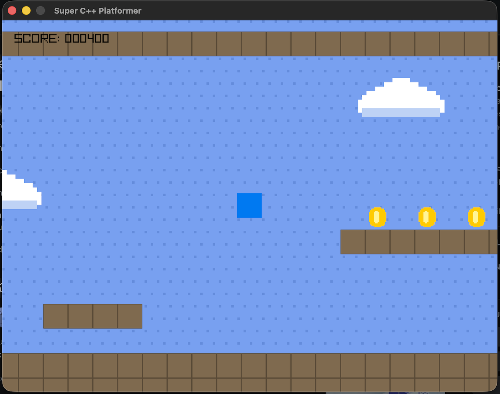

# Super C++ Platformer

A 2D scrolling platformer built from scratch in C++ using Raylib.

## Features
- **Continuous Physics System:** Gravity, acceleration, and jumping.
- **AABB Collision Detection:** Accurate bounding box logic for tile maps.
- **Infinite Scrolling Camera:** Smooth 2D camera following the player.
- **Animated Pixel Art:** 8-bit style clouds and spinning coins.
- **Ledge-Detecting Enemy AI:** Patrolling enemies that smartly reverse at edges.

## Screenshot

