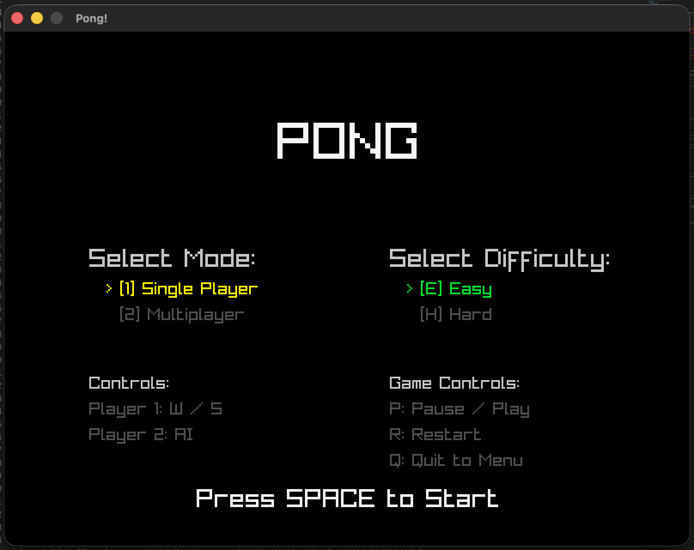

# Pong

Welcome to the second graphical game in our curriculum! In this project, we are building a 2-player clone of the classic arcade game, Pong, complete with a menu system, AI, and dynamic physics!




## About the Game

Pong is a fast-paced game of digital table tennis.

- **Modes:** Play against a friend in Multiplayer, or take on the computer in Single Player mode (with Easy and Hard difficulties).
- **Controls:**
  - **Player 1:** `W` and `S`
  - **Player 2:** `Up` and `Down` (Multiplayer only)
  - **Game Controls:** `P` to Pause/Play, `R` to Restart, `Q` to Quit to Menu.
- **Scoring:** First player to reach 10 points wins!
- **Dynamic Physics:** Hitting the ball with the very edge of your paddle will send it flying at a sharp vertical angle, while hitting it dead center will keep it flat. Use this to outmaneuver your opponent!

## Learning Objective

This project builds upon the basics of the Clicker game and introduces state machines, dynamic physics, and audio playback.

## What this game teaches:

- **State Machines (`enum`):** Using an `enum GameState` to smoothly transition the game loop between the `MENU`, `PLAYING`, `PAUSED`, and `GAME_OVER` screens.
- **Audio Playback:** Initializing the Raylib Audio Device and triggering `.wav` files whenever collisions occur or points are scored.
- **Basic AI:** Writing simple tracking logic so that Player 2's paddle automatically follows the ball's Y position when Single Player mode is selected.
- **Delta Time (`GetFrameTime()`):** Multiplying our movement speed by Delta Time to ensure the ball moves at exactly the same speed regardless of how fast or slow the computer running the game is.
- **Dynamic Collision Physics:** Calculating where exactly the ball hits the paddle to determine the resulting vertical rebound angle.

## Prerequisites

This project uses **CMake** to automatically fetch the Raylib graphics library from the internet. You do not need to install Raylib manually! However, you must have CMake installed on your system.

**Mac:**

```bash
brew install cmake
```

**Windows:**
Download and install CMake from the official website: [cmake.org/download](https://cmake.org/download/)
_(Make sure to check the box "Add CMake to the system PATH for all users" during installation)._

**Linux (Ubuntu/Debian):**

```bash
sudo apt update
sudo apt install cmake build-essential libgl1-mesa-dev libx11-dev libxrandr-dev libxi-dev libxcursor-dev libxinerama-dev libxxf86vm-dev
```

## How to Build and Run

We use a "build" folder to keep all the compiled files separate from our clean C++ code.

1. Open your terminal and navigate to this folder:
   ```bash
   cd games/pong
   ```
2. Create the build directory and enter it:
   ```bash
   mkdir build
   cd build
   ```
3. Tell CMake to configure the project (it will download Raylib for you):
   ```bash
   cmake -DCMAKE_POLICY_VERSION_MINIMUM=3.5 ..
   ```
4. Compile the game:
   ```bash
   make
   ```
5. Play!
   ```bash
   ./Pong
   ```

_(Tip: In the future, you only need to run step 4 and 5 after changing the code in `main.cpp`!)_
